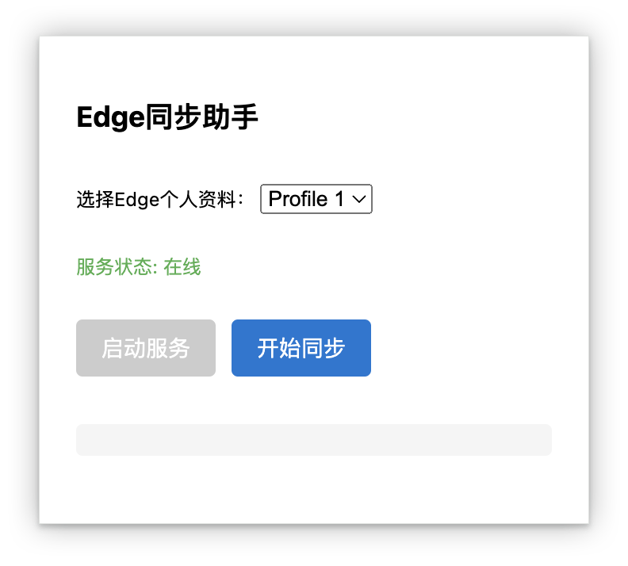

# Edge Sync Helper

[](LICENSE)
[](https://github.com/gaoshuping99/edge-bookmarks-sync/stargazers)
[](https://github.com/gaoshuping99/edge-bookmarks-sync/issues)

## English Description

**Edge Sync Helper** is a Manifest V3 browser extension that enables one-click synchronization of bookmarks (with multi-profile support), accounts, and passwords from Microsoft Edge to your current browser (Chrome/Edge). It preserves the original folder structure and order, supports multi-profile selection, sync progress feedback, error handling, and retry mechanism. Ideal for cross-device and cross-browser migration of bookmarks and credentials.

## 项目简介

Edge同步助手是一款基于Manifest V3的浏览器扩展，支持将Microsoft Edge浏览器的收藏夹（多Profile）、账号、密码等数据一键同步到当前浏览器（Chrome/Edge），并保留原有目录结构和顺序。

## 功能特性
- 支持多Profile选择与同步
- 保留Edge原有收藏夹目录结构与顺序
- 同步进度可视化、错误处理与重试机制
- 跨设备、跨浏览器迁移收藏夹与账号
- 支持Edge密码导出与导入（Windows/macOS）
- 实时同步状态反馈
- 数据加密存储与传输

## 快速开始

1. 克隆本仓库
```bash
git clone https://github.com/gaoshuping99/edge-bookmarks-sync.git
cd edge-bookmarks-sync
```

2. 安装依赖并启动本地服务
```bash
# 安装Node.js依赖
cd server
npm install

# 安装Python依赖（密码导出功能需要）
pip install -r requirements.txt

# 启动服务
npm start
```

3. 加载浏览器扩展
- 打开Chrome/Edge浏览器
- 进入扩展管理页面（chrome://extensions/）
- 开启开发者模式
- 点击"加载已解压的扩展程序"
- 选择项目根目录

4. 使用扩展
- 点击扩展图标
- 选择要同步的Edge Profile
- 点击"开始同步"按钮

## 密码导出功能

### Windows系统
```bash
python server/export_edge_passwords.py [profile_name]
```

### macOS系统
```bash
python server/export_edge_passwords_macos.py [profile_name]
```

导出的密码将保存在桌面上的`edge_passwords.csv`文件中。

## 用法截图

> 
> 

## 更新日志

### v1.1.0 (2024-03-xx)
- 新增Edge密码导出功能，支持Windows/macOS系统
- 新增密码导入导出工具
- 优化同步逻辑，提升稳定性
- 修复已知问题

### v1.0.0 (2024-03-xx)
- 首次发布
- 支持收藏夹同步
- 支持多Profile
- 基础UI界面

## 技术栈
- Manifest V3
- React 18 + Vite
- Node.js + Express
- Web Crypto API
- Python (密码导出功能)

## 贡献指南
欢迎提交Issue和Pull Request！在提交PR之前，请确保：
1. 代码符合项目规范
2. 添加了必要的测试
3. 更新了相关文档

## License
MIT 