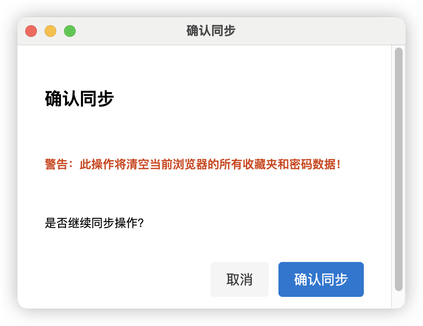

# Edge Sync Helper

## English Description

**Edge Sync Helper** is a Manifest V3 browser extension that enables one-click synchronization of bookmarks (with multi-profile support), accounts, and passwords from Microsoft Edge to your current browser (Chrome/Edge). It preserves the original folder structure and order, supports multi-profile selection, sync progress feedback, error handling, and retry mechanism. Ideal for cross-device and cross-browser migration of bookmarks and credentials.

## 项目简介

Edge同步助手是一款基于Manifest V3的浏览器扩展，支持将Microsoft Edge浏览器的收藏夹（多Profile）、账号、密码等数据一键同步到当前浏览器（Chrome/Edge），并保留原有目录结构和顺序。

## 功能特性
- 支持多Profile选择与同步
- 保留Edge原有收藏夹目录结构与顺序
- 同步进度可视化、错误处理与重试机制
- 跨设备、跨浏览器迁移收藏夹与账号

## 快速开始

1. 克隆本仓库
2. 安装依赖并启动本地服务
3. 加载浏览器扩展，选择Profile并同步

## 用法截图

> 
> 

（如需自定义截图，请将图片放入 `docs/` 目录，并替换上方图片路径）

## 技术栈
- Manifest V3
- React 18 + Vite
- Node.js + Express
- Web Crypto API

## License
MIT 